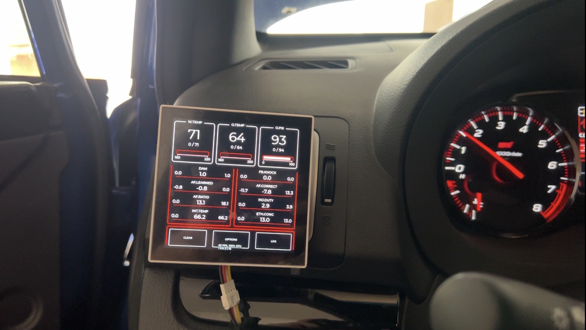

# ESP32 Gauge Pod 2

ESP32 project for One Display To Rule Them All for a VA generation WRX STI. Data is gathered from the ECU and ABS modules plus aftermarket
sensors for oil temp/pressure and is displayed with realtime monitoring/alerting all in one device. It can also advertise this data over BLE for apps like AutoX DL, RaceChrono, etc.

V2 of https://github.com/ndesilets/esp32-gauge-pod



General diagram of how it works:

```text
Subaru ECU / VDC ── CAN (500 kbps) ──> ESP32-S3 data hub <── analog sensors
                                         │
                                         ├── RaceChrono DIY BLE telemetry
                                         │
                                         └── UART (115200, framed MessagePack)
                                                        │
                                                        v
                                             ESP32-P4 gauge display
                                             ├── LVGL UI and audio alerts
                                             ├── Realtime monitoring
                                             ├── CSV logging to SD card
                                             └── USB mass-storage access to SD card
```

## Hardware Used

- ESP32S3 (esp-data-hub)
  - ADS1115 ADC (ESP's built in ADC is mid)
  - Random buck converter to step 12v down to 5v
  - Random logic level converter
  - Adafruit CAN PAL transceiver
- Waveshare ESP32-P4 Smart 86 Box (esp32-data-display-2)

## What it can do

- Polls Subaru SSM ECU data and VDC/ABS data over CAN with.
- Reads analog oil temperature and oil pressure sensors through an ADS1115.
- Sends telemetry packets over UART for whatever you want
- Display has realtime monitoring and can scream at you when The Bad:tm: happens
- Can log all telemetry to CSV files on an SD card
- Shows up as a USB mass storage device when plugged in to grab said log files
- Offers a RaceChrono DIY BLE CAN-Bus service for throttle position, brake
  pressure, and steering angle. But this is easily expandable to include whatever

## Repository layout

| Path                                                           | Purpose                                                                                                                             |
| -------------------------------------------------------------- | ----------------------------------------------------------------------------------------------------------------------------------- |
| [`esp-data-hub-2/`](esp-data-hub-2/)                           | ESP32-S3 data-hub firmware: gets all the data I care about.                                                                         |
| [`esp32-data-display-2/`](esp32-data-display-2/)               | ESP32-P4 display firmware: displays all the data I care about.                                                                      |
| [`esp32-shared/`](esp32-shared/)                               | Shared library between the above two projects.                                                                                      |
| [`canhacker-usb-adapter/`](canhacker-usb-adapter/)             | ESP32-S3 CANHacker-compatible USB CAN adapter. Useful for packet sniffing/offline analysis                                          |
| [`scripts/subaru-decode/`](scripts/subaru-decode/)             | Script for decoding CANHacker traces with stuff for also decoding Subaru ECU memory addresses/values from SSM.                      |
| [`scripts/parse-foxwell-nt614/`](scripts/parse-foxwell-nt614/) | Script for extracting values from Foxwell NT614 scan logs. I used this for the ABS module for getting brake pressure/steering angle |
| [`docs/`](docs/)                                               | Mostly AI slop for arch docs to keep it in line.                                                                                    |

## Build and flash

Both primary firmware projects use ESP-IDF 5.5.1. Upgrading to v6 is not fun at the moment.
Build each project from its own directory; the shared component is included automatically.

```powershell
# ESP32-S3 data hub
cd esp-data-hub-2
idf.py build
idf.py -p COM3 flash monitor

# ESP32-P4 display
cd ..\esp32-data-display-2
idf.py build
idf.py -p COM4 flash monitor
```

Replace the ports with the ports assigned to the boards. The checked-in project
configurations target `esp32s3` for the hub and `esp32p4` for the display.

For board setup, UART pins, CAN/I2C defaults, mock data, and configuration
options, see the [build guide](docs/build.md).

## Development checks

The telemetry and ISO-TP codecs, data-hub SSM/oil-pressure/RaceChrono logic,
and display alert monitoring have small host-side C tests. Run them from the
repository root with a C11 compiler:

```powershell
gcc -std=c11 -Wall -Wextra -Werror -DMPACK_NODE=0 -DMPACK_BUILDER=0 `
  -Iesp32-shared/include -Iesp32-shared/third_party/mpack `
  esp32-shared/src/telemetry_protocol.c esp32-shared/third_party/mpack/mpack.c `
  esp32-shared/test/test_telemetry_protocol.c -o telemetry_protocol_test
.\telemetry_protocol_test

gcc -std=c11 -Wall -Wextra -Werror -Iesp-data-hub-2/main/data_analog `
  esp-data-hub-2/main/data_analog/pressure_filter.c `
  esp-data-hub-2/test/test_pressure_filter.c -lm -o pressure_filter_test
.\pressure_filter_test

gcc -std=c11 -Wall -Wextra -Werror -Iesp32-shared/include `
  -Iesp-data-hub-2/main/racechrono `
  esp-data-hub-2/main/racechrono/racechrono_packet.c `
  esp-data-hub-2/test/test_racechrono_packet.c -lm -o racechrono_packet_test
.\racechrono_packet_test

gcc -std=c11 -Wall -Wextra -Werror -Iesp-data-hub-2/main/data_canbus `
  esp-data-hub-2/main/data_canbus/isotp_codec.c `
  esp-data-hub-2/test/test_isotp_codec.c -o isotp_codec_test
.\isotp_codec_test

gcc -std=c11 -Wall -Wextra -Werror -Iesp-data-hub-2/main/data_canbus `
  esp-data-hub-2/main/data_canbus/request_ecu.c `
  esp-data-hub-2/test/test_request_ecu.c -lm -o request_ecu_test
.\request_ecu_test

gcc -std=c11 -Wall -Wextra -Werror -Iesp32-data-display-2/main `
  esp32-data-display-2/main/monitoring.c `
  esp32-data-display-2/test/test_monitoring.c -lm -o monitoring_test
.\monitoring_test
```

The same commands in POSIX shells use `\` for line continuation and `./` to
run the generated executables.

## Documentation

If you want to read some AI slop on how different parts of this work see the following:

- [Architecture](docs/architecture.md) — component responsibilities, data flow, task priorities, and alerts.
- [Protocols](docs/protocols.md) — CAN IDs, ISO-TP, SSM/UDS requests, UART framing, and telemetry schema.
- [Build guide](docs/build.md) — flashing, project configuration, and hardware-free test modes.

## Shout outs

https://www.youtube.com/@T-WRXMechanic/videos for showing how accessports/subaru select monitor works

## Disclaimers

If you somehow blow your car up or destroy the fabric of space and time with this I don't care that's on you bud
